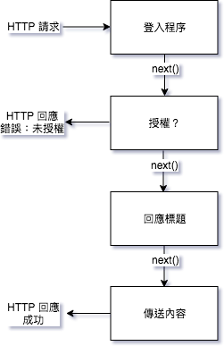
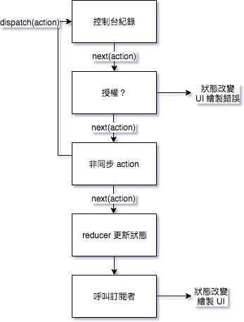

# Chap 08. Redux

Redux 是 Flux or 類似 Flux 的函式庫競爭中的勝利者之一。Redux 基於 Flux，針對應用程式的資料異動流所設計。

Redux 令人意外的小，只有 99 行程式碼。

Redux 去掉 dispatcher，並使用單一不可變物件表示應用程式狀態以稍微簡化 Flux 的概念。Redux 還引進 Flux 模式沒有的 reducer。reducer 是工具目前狀態與 action 回傳新狀態的純函式：`(state, action) => newState`。

## 狀態

在純 React 或 Flux 應用程式中，建議將狀態盡可能儲存在幾個物件中。在 Redux 中這是規定。

將狀態分散在不同元件的社交媒體應用程式為例，所有資料儲存於狀態中：user 狀態、message 狀態與 post 狀態。這種結構的應用程式可運行的很好，但隨著程式成長會難以判斷應用程式的整體狀態。元件在內部的 setState 呼叫中改變自己的狀態也會讓異動的來源難以判斷。

有什麼訊息被修改？哪些發文已讀？為識別這些細節，我們必須深入元件樹並追蹤個別元件內的狀態。

Redux 提供要求將狀態資料集中儲存在單一物件中，以簡化檢視應用程式內狀態的方式。我們需要知道的每件事都在同一處：單一的事實來源。我們可用 Redux 將所有狀態資料集中以建構相同的應用程式。

在社交媒體應用程式中，我們在同一物件中管理目前使用者、訊息與發文的狀態：Redux store。此物件甚至儲存訊息編輯、哪個訊息被修改與哪些發文已讀等資訊。此資訊儲存在以 ID 參考紀錄的陣列中。所有訊息與發文都快取在此狀態物件中，因此資料都在這裡。

使用 Redux，我們將狀態管理從 React 中完全抽出，由 Redux 管理狀態。

以下顯示社交媒體應用程式的狀態樹

```
<Root>
  ├── {user}
  ├── [messages]
  ├── editMessage
  ├── [expandedMessages]
  ├── [posts]
  └── [postsSeen]
```

建構 Redux 應用程式時，要考慮的第一件事是狀態。嘗試將它定義在單一物件中。以 JSON 樣本與一些資料作狀態樹的初稿通常是個好辦法。

回到顏色管理程式：

```json
{
  "colors": [
    {
      "id": "8658c1d0-9eda-4a90-95e1-8001e8eb6036",
      "title": "Ocean Blue",
      "color": "#0070ff",
      "rating": 3,
      "timestamp": "Sat Mar 12 2016 16:12:09 GMT-0800 (PST)"
    },
    {
      "id": "f9005b4e-975e-433d-a646-79df172e1dbb",
      "title": "Tomato",
      "color": "#d10012",
      "rating": 2,
      "timestamp": "Fri Mar 11 2016 12:00:00 GMT-0800 (PST)"
    },
    {
      "id": "58d9caee-6ea6-4d7b-9984-65b145031979",
      "title": "Lawn",
      "color": "#67bf4f",
      "rating": 1,
      "timestamp": "Thu Mar 10 2016 01:11:12 GMT-0800 (PST)"
    },
    {
      "id": "a5685c39-6bdc-4727-9188-6c9a00bf7f95",
      "title": "Party Pink",
      "color": "#ff00f7",
      "rating": 5,
      "timestamp": "Wed Mar 9 2016 03:26:00 GMT-0800 (PST)"
    }
  ],
  "sort": "SORTED_BY_DATE"
}
```

現在已找出應用程式狀態的基本結構，接下來看看如何透過 action 更新與改變此狀態。

## action

Redux 重要規則：應用程式的狀態應該儲存在一個不可變物件中。不可變意味此狀態物件不會改變。我們以替換方式更新此物件。因此，我們需要改變的指令，這就是 action 的作用：改變應用程式狀態的指令與改變的相關資料。

action 是 Redux 應用程式更新狀態的唯一方式。action 提供關於改變的指令，但我們也可以將它視為異動歷史的紀錄。

設計物件導向應用程式時我們通常從辨識物件、物件屬性與物件相互作用開始。這種思維方式稱為名詞導向。建構 Redux 應用程式，我們會將思維改為**動詞導向**。action 如何影響狀態資料？辨識出 action 後，你可以將它們列在 constants.js 檔案中。

```javascript
const constants = {
  SORT_COLORS: "SORT_COLORS",
  ADD_COLOR: "ADD_COLOR",
  RATE_COLOR: "RATE_COLOR",
  REMOVE_COLOR: "REMOVE_COLOR"
};

export default constants;
```

此處我們定義每個 action 型別的字串值。action 是個至少有一個欄位的 JavaScript 物件：

```javascript
{ type: 'ADD_COLOR' }
```

action type 是定義要做什麼的字串。ADD_COLOR 是新增顏色到應用程式狀態的顏色清單動作。

但這樣字串建構容易打錯字，導致狀態資料沒有如預期的改變，這種錯誤很難找到。這就要靠常數幫忙：

```javascript
import C from './constants'

{ type: C.ADD_COLOR }
```

> Top! action 型別的命名慣例  
> action 型別通常全大寫並以底線代替空格。你應該清楚表達 action 目的。

### action 的酬載

action 是提供狀態改變的指令之 JavaScript 實字。大部分的異動也需要一些資料。要刪除哪一筆紀錄？要提供新紀錄的什麼資訊？

我們將這種資料稱為 action 的酬載。舉例來說，分發 RATE_COLOR 這個 action 時，我們會需要知道要評分什麼顏色與給出的分數。這種資訊可在同一個 JavaScript 實字中直接傳遞。

```javascript
{
  type: 'RATE_COLOR',
  id: 'a5685c39-6bdc-4727-9188-6c9a00bf7f95',
  rating: 4
}
```

新增顏色時，我們需要列出顏色的細節：

```javascript
{
  type: 'ADD_COLOR',
  color: '#FFFFFF',
  title: 'Bright White',
  rating: 0,
  id: 'a5685c39-6bdc-4727-9188-6c9a00bf7f95',
  timestamp: 'Sat Mar 12 2016 16:12:09 GMT-0800 (PST)'
}
```

新顏色的所有資訊都放在 action 中。action 是告訴 Redux 如何改變狀態的資料包，它們還帶有 Redux 做出改變所需的相關資料。

## reducer

狀態樹儲存在單一物件中。有一個潛在的問題是不夠模組化，可能因為你是以物件模組化的想法來看。Redux 透過函式達成模組化，**函式用於更新狀態樹內容**。這些函式稱為 reducer。

reducer 是以目前狀態與 action 作為參數建構並回傳新狀態的函式，它用於更新狀態樹的葉或分支。我們可以組合多個 reducer 到一個 reducer 中來處理整個狀態的更新。

顏色管理應用程式的狀態範例：

```json
{
  "colors": [
    {
      "id": "8658c1d0-9eda-4a90-95e1-8001e8eb6036",
      "title": "Ocean Blue",
      "color": "#0070ff",
      "rating": 3,
      "timestamp": "Sat Mar 12 2016 16:12:09 GMT-0800 (PST)"
    },
    {
      "id": "f9005b4e-975e-433d-a646-79df172e1dbb",
      "title": "Tomato",
      "color": "#d10012",
      "rating": 2,
      "timestamp": "Fri Mar 11 2016 12:00:00 GMT-0800 (PST)"
    },
    {
      "id": "58d9caee-6ea6-4d7b-9984-65b145031979",
      "title": "Lawn",
      "color": "#67bf4f",
      "rating": 1,
      "timestamp": "Thu Mar 10 2016 01:11:12 GMT-0800 (PST)"
    },
    {
      "id": "a5685c39-6bdc-4727-9188-6c9a00bf7f95",
      "title": "Party Pink",
      "color": "#ff00f7",
      "rating": 5,
      "timestamp": "Wed Mar 9 2016 03:26:00 GMT-0800 (PST)"
    }
  ],
  "sort": "SORTED_BY_DATE"
}
```

這個狀態資料有兩個主要分支：colors 與 sort。

- sort 分支是個葉，沒有子節點
- colors 分支儲存多個顏色，每個顏色物件代表一個葉

特定 reducer 會處理此狀態樹的特定部分。每個 reducer 是個函式，可一起處理。如下：

```javascript
import C from '../constants';

export const color = (state = [], action) => {
  return {};
};

export const colors = (state = [], action) => {
  return [];
};

export const sort = (state = "SORTED_BY_DATE", action) => {
  return "";
};
```

每個函式處理狀態樹的某個部份。每個函式回傳值與初始狀態對應它在狀態樹的資料型別。

每個 reducer 只處理更新狀態樹特定部分的更新。

- color 的 reducer 只處理 color 物件的 action：ADD_COLOR 與 RATE_COLOR
- colors 的 reducer 只處理 colors 陣列的 action：ADD_COLOR、REMOVE_COLOR 與 RATE_COLOR
- sort 的 reducer 處理 SORT_COLORS 這個 action

每個 reducer 由操作 store 的 reducer 函式組成，color 的 reducer 由 color 的 reducer 組成以管理陣列中的個別顏色。然後 sort 的 reducer 與 colors 的 reducer 組合以建構單一 reducer 函式，它可以更新整個狀態樹並處理任何傳給它的 action。

color 與 colors 的 reducer 都會處理 ADD_COLOR 與 RATE_COLOR，但要記得每個 reducer 專注於狀態樹的特定部分。

- color 的 reducer 對 RATE_COLOR 處理個別顏色值評分的改變
- colors 的 reducer 對 RATE_COLOR 找尋陣列中要被評分的顏色
- color 的 reducer 對 ADD_COLOR 產生具有正確屬性的新 color 物件
- colors 的 reducer 對 ADD_COLOR 回傳新增 color 物件後的陣列

它們要共同運作，每個 reducer 專注於特定狀態樹分支的 action。

> Top! reducer 的組合並非必要，只是建議  
> 我們可以用一個 reducer 函式來處理所有的 action，只是這麼做不利於模組化與函式性程式設計。

### color 的 reducer

```javascript
export const color = (state = {}, action) => {
  switch (action.type) {
    case C.ADD_COLOR:
      return {
        id: action.id,
        title: action.title,
        color: action.color,
        timestamp: action.timestamp,
        rating: 0
      };
    case C.RATE_COLOR:
      return (state.id !== action.id) ?
        state :
        {
          ...state,
          rating: action.rating
        };
    default:
      return state;
  }
};
```

以下是 color reducer 的 action

- ADD_COLOR

  以 action 的酬載資料建構新的 color

- RATE_COLOR

  以指定的評分回傳新的 color 物件。ES7 的物件展開運算子讓我們能指派目前狀態值給新物件

reducer 一定要回傳某個值。若 reducer 遇到不認識的
action，將回傳目前的狀態：default 這個 case


你會注意到 RATE_COLOR 傳遞 color 的 reducer 沒有用到的 ID，這是因為此 action
的 ID 是給其他 reducer 找出該 color 用的。一個 action 可以影響多個 reducer。

### colors 的 reducer

color 的 reducer 用於管理狀態樹下 colors 分支，colors 的 reducer
會用來管理整個 colors 分支：

```javascript
export const colors = (state = [], action) => {
  switch (action.type) {
    case C.ADD_COLOR:
      return [
        ...state,
        color({}, action)
      ];
    case C.RATE_COLOR:
      return state.map(
        c => color(c, action)
      );
    case C.REMOVE_COLOR:
      return state.filter(
        c => c.id !== action.id
      );
    default:
      return state;
  }
};
```

- ADD_COLOR

  以現有狀態陣列加上新的 color 物件產生新的陣列。新的顏色是透過傳給 color 的
  reducer 空白狀態物件與 action 來產生

- RATE_COLOR

  回傳具有目標評分的新顏色陣列。colors 的 reducer
  從目前狀態陣列找出要評分的顏色，然後使用 color 的 reducer 取得有新評分的顏色物件並取得陣列中的物件

- REMOVE_COLOR

  刪除指定顏色後建立新陣列

colors 的 reducer 涉及顏色的陣列，它使用 color 的 reducer 來聚焦個別的顏色物件。

> Top! 是狀態為不可變物件  
> 在 reducer
> 中，我們必須視狀態為不可變物件。雖然有想要使用 `state.push({})` or
> `state[index].rating`，但應該避免這麼做

> Top! reducer 不能有副作用  
> reducer
> 應該可預測，它們只用於管理狀態資料。上面例子中，timestamp 與 ID 都是在將
> action 傳送給 reducer 前產生。產生隨機資料、呼叫 API 與其他非同步程序都應該在
> reducer 之外處理。要避免狀態的改變與副作用。

### sort 的 reducer

sort 的 reducer 是用於管理狀態中一個字串變數的函式：

```javascript
export const sort = (state = "SORTED_BY_DATE", action) => {
  switch (action.type) {
    case C.SORT_COLORS:
      return action.sortBy
    default:
      return state;
  }
};
```

總而言之，狀態更新由 reducer 處理。reducer 是純函式，以狀態作為第一個參數而 action 是第二個參數。reducer 不會引發副作用且視參數為不可變資料。在 Redux 中，模組化透過 reducer 達成。reducer 最終組合成單一 reducer，它是能夠更新整個狀態樹的函式。

下一節討論 color 的 reducer 如何與 sort 的 reducer 組合以更新狀態。

## store

在 Redux 中，store 儲存應用程式的狀態資料並處理所有狀態更新。雖然 Flux 設計模式允許多個特定用途的 store，但 Redux 只有一個 store。

store 透過傳入目前狀態與 action 給一個 reducer 來處理狀態更新。我們會組合所有的 reducer 來製作這個單一 reducer。

若所有 colors 的 reducer 建構 store，則狀態物件會是一個陣列 —— 顏色的陣列。store 的 getState 方法會回傳應用程式目前的狀態。以下以 color 的 reducer 建構一個 store：

```javascript
import {createStore} from "redux";
import {color} from './reducer';

const store = createStore(color);

console.log(store.getState()); // {}
```

為建構以上的單一 reducer 樹，我們必須組合 colors 與 sort 的 reducer。Redux 的 combineReducers 函式可組合 reducer 成單一 reducer。這些 reducer 用於建構你的狀態樹，傳入的欄位名稱與 reducer 的名稱相符。

store 也可以用初始資料建構。無狀態呼叫 colors 的 reducer 會回傳一個空陣列：

```javascript
import {createStore, combineReducers} from "redux";
import {colors, sort} from './reducer';

const store = createStore(combineReducers({colors, sort}));

console.log(store.getState());

// 控制台輸出

// {
//   colors: [],
//   sort: "SORTED_BY_DATE"
// }
```

以下以三個顏色與 SORTED_BY_TITLE 的 sort 值建構：

```javascript
import {createStore, combineReducers} from "redux";
import {colors, sort} from './reducer';

const initialState = {
  "colors": [
    {
      "id": "8658c1d0-9eda-4a90-95e1-8001e8eb6036",
      "title": "Ocean Blue",
      "color": "#0070ff",
      "rating": 3,
      "timestamp": "Sat Mar 12 2016 16:12:09 GMT-0800 (PST)"
    },
    {
      "id": "f9005b4e-975e-433d-a646-79df172e1dbb",
      "title": "Tomato",
      "color": "#d10012",
      "rating": 2,
      "timestamp": "Fri Mar 11 2016 12:00:00 GMT-0800 (PST)"
    },
    {
      "id": "58d9caee-6ea6-4d7b-9984-65b145031979",
      "title": "Lawn",
      "color": "#67bf4f",
      "rating": 1,
      "timestamp": "Thu Mar 10 2016 01:11:12 GMT-0800 (PST)"
    },
    {
      "id": "a5685c39-6bdc-4727-9188-6c9a00bf7f95",
      "title": "Party Pink",
      "color": "#ff00f7",
      "rating": 5,
      "timestamp": "Wed Mar 9 2016 03:26:00 GMT-0800 (PST)"
    }
  ],
  "sort": "SORTED_BY_DATE"
};

const store = createStore(combineReducers({colors, sort}), initialState);

console.log(store.getState().colors.length); // 3
console.log(store.getState().sort); // "SORTED_BY_TITLE"
```

改變應用程式的狀態的唯一辦法是透過 store 分發 action。store 有個 dispatch 方法可接受 action 作為參數。透過 store 分發 action 時，action 透過 reducer 傳送以更新狀態：

```javascript
store.dispatch({
  type: "ADD_COLOR",
  id: "2222e1p5-3abl-0p523-30e4-8001l8yf2222",
  title: "Party Pink",
  color: "#F142FF",
  timestamp: "Thu Mar 10 2016 01:11:12 GMT-0800 (PST)"
});

store.dispatch({
  type: 'RATE_COLOR',
  id: "2222e1p5-3abl-0p523-30e4-8001l8yf2222",
  rating: 5
});
```

改變資料的唯一辦法是分發 action 給 store。

### 訂閱 store

store 可讓你訂閱處理函式以讓 store 於完成 action 後叫用。下面範例紀錄狀態中的顏色數量：

```javascript
store.subscribe(() =>
  console.log('color clount:', store.getState().colors.length)
);

store.dispatch({
  type: "ADD_COLOR",
  id: "2222e1p5-3abl-0p523-30e4-8001l8yf2222",
  title: "Party Pink",
  color: "#F142FF",
  timestamp: "Thu Mar 10 2016 01:11:12 GMT-0800 (PST)"
});

store.dispatch({
  type: "ADD_COLOR",
  id: "3315e1p5-3abl-0p523-30e4-8001l8yf2412",
  title: "Big Blue",
  color: "#0000FF",
  timestamp: "Thu Mar 10 2016 01:11:12 GMT-0800 (PST)"
});

store.dispatch({
  type: 'RATE_COLOR',
  id: "2222e1p5-3abl-0p523-30e4-8001l8yf2222",
  rating: 5
});

store.dispatch({
  type: 'REMOVE_COLOR',
  id: '3315e1p5-3abl-0p523-30e4-8001l8yf2412'
});

// 控制台輸出：

// color count: 1
// color count: 2
// color count: 2
// color count: 1
```

以此傾聽程序訂閱 store 會在我們提交 action 時從控制台輸出顏色的數量。

store 的 subscribe 方法回傳之後可供取消傾聽程序訂閱的函式：

```javascript
const logState = () => console.log('next state', store.getState());

const unsubscribeLogger = store.subscribe(logState);

// 取消訂閱時呼叫
unsubscribeLogger();
```

### 儲存於 localStorage

使用 store 的 subscribe 函式可以傾聽狀態異動並將異動儲存在 localStorage 的 'redux-store' 鍵之下。建構 store 時可先檢查是否已經有資料儲存於該鍵之下，若有則載入該資料作為初始狀態。只要加上幾行程式碼，我們就可以在瀏覽器保存資料：

```javascript
const store = createStore(
  combineReducers({colors, sort}),
  (localStorage['redux-store'] ?
     JSON.parse(localStorage['redux-store']) :
     {}
  )
);

store.subscribe(() =>
  localStorage['redux-store'] = JSON.stringify(store.getState())
);

store.dispatch({
  type: 'ADD_COLOR',
  id: uuid.v4(),
  title: 'Party Pink',
  color: '#F142FF',
  timestamp: new Date().toString()
});
```

總而言之，store 儲存與管理 Redux 應用程式的狀態資料，而唯一改變狀態資料的辦法是分發 action 給 store。store 以單一物件保存應用程式的狀態。狀態變化由 reducer 管理。store 以提供選擇性初始狀態資料給 reducer 建構。還有，我們可以用傾聽程序訂閱 (與取消訂閱) 的 store，它們會在完成 action 後被叫用。

## action 的建構程序

action 物件只是 JavaScript 實字，action 建構程序是建構與回傳這些實字的函式。以下列 action 為例：

```javascript
{
  type: 'REMOVE_COLOR',
  id: '3315e1p5-3abl-0p523-30e4-8001l8yf2412'
}

{
  type: 'RATE_COLOR',
  id: '441e0p2-9ab4-0p523-30e4-8001l8yf2412',
  rating: 5
}
```

我們可以對這些 action 型別加上 action 建構程序來簡化產生 action 的邏輯：

```javascript
import C from './constants';

export const removeColor = id =>
  ({
    type: C.REMOVE_COLOR,
    id
  });

export const rateColor = (id, rating) =>
  ({
    type: C.RATE_COLOR,
    id,
    rating
  });
```

接下來需要分發 RATE_COLOR 或 REMOVE_COLOR 時，我們可以使用此 action 建構程序並以函式參數傳入必要的資料：

```javascript
store.dispatch(removeColor('3315e1p5-3abl-0p523-30e4-8001l8yf2412'));
store.dispatch(rateColor('441e0p2-9ab4-0p523-30e4-8001l8yf2412', 5));
```

action 的建構程序簡化分發 action 的工作；我們只需要呼叫一個函式並傳入必要的資料。可抽離如何建構 action 的細節，如此可大幅簡化建構 action 的程序。以下舉例：

```javascript
export const sortColors = sortedBy =>
  (sortedBy === 'rating') ?
    ({
      type: C.SORT_COLORS,
      sortBy: 'SORTED_BY_RATING'
    }) :
    (sortedBy === 'title') ?
      ({
        type: C.SORT_COLORS,
        sortBy: 'SORTED_BY_TITLE'
      }) :
      ({
        type: C.SORT_COLORS,
        sortBy: 'SORTED_BY_DATE'
      });

store.dispatch(sortColors('title'));
```

action 的建構程序可以包含邏輯，也可以抽離建構 action 的細節。以加入一個顏色的 action 為例：

```javascript
{
  type: 'ADD_COLOR',
  id: uuid.v4(),
  title: 'Party Pink',
  color: '#F142FF',
  timestamp: new Date().toString()
}
```

現在 ID 與 timestamp 在 action 被分發時產生。將此邏輯移至 action 的建構程序可將細節從分發 action 的程序中抽離：

```javascript
import C from './constants';
import {v4} from 'uuid';

export const addColor = (title, color) =>
  ({
    type: C.ADD_COLOR,
    id: v4(),
    title,
    color,
    timestamp: new Date().toString()
  });
```

現在建構新顏色更為容易：

```javascript
store.dispatch(addColor('#F142FF', 'Party Pink'));
```

action 建構程序的好處是它們提供封裝建構 action 的邏輯的地方。這讓應用程序的除錯更為容易。

我們應該將與後端 API 通訊的邏輯放在 action 的建構程序中。使用 action 建構程序時，我們可以執行請求資料或呼叫 API 等非同步邏輯。Ch12 介紹伺服器會討論這個部分。

### compose

Redux 有個 compose 函式可用於組合不同函式成一個函式。它類似第三章建構的 compose 函式，但更為扎實。它還相反的從右至左組合函式。

若想要得到以逗號分隔的顏色名稱清單，我們可以使用下面這一行程式碼：

```javascript
store.getState().colors.map(c=>c.title).join(', ')
```

更函式性做法會將它拆開成較小的函式，並組合成單一函式：

```javascript
import {compose} from 'redux';

const print = compose(
  list => console.log(list),
  titles => titles.join(', '),
  map => map(c => c.title),
  colors => colors.map.bind(colors),
  state => state.colors
)

print(store.getState());
```

## 中介軟體

如果你使用過 Express、Sinatra、Django、KOA 或 ASP.NET 等伺服器端框架，則你應該熟悉**中介軟體**的概念 (中介軟體黏合軟體不同層或不同的部分)。

Redux 也是個中介軟體，它在 store 的分發管道中起作用。在 Redux 中，中介軟體如下所示由分發 action 程序中一系列連續執行的函式組成：



這些高階函式能讓你在分發 action 與狀態更新的前後插入其他功能。每個中介軟體函式依序執行。

中介軟體的每個部分是一個存取 action 的函式、一個 dispatch 函式，與一個會呼叫 next 的函式。next 使得更新發生，你可以在呼叫 next 之前修改 action。next 之後狀態就被改變。



### store 套用中介軟體

