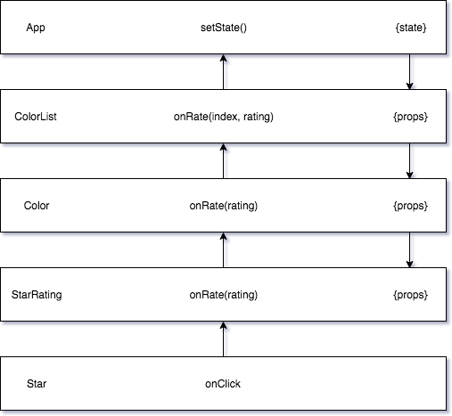

# Chap 09. React Redux

這章要結合第六章建構的 UI 與上一章建構的 store。

第六章開發的應用程式將狀態集中在單一物件中 —— App 元件。

```javascript
class App extends Component {
  constructor() {
    super(...arguments);
    this.state = {
      colors: [
        {
            "id": "0175d1f0-a8c6-41bf-8d02-df5734d829a4",
            "title": "ocean at dusk",
            "color": "#00c4e2",
            "rating": 5
        },
        {
            "id": "83c7ba2f-7392-4d7d-9e23-35adbe186046",
            "title": "lawn",
            "color": "#26ac56",
            "rating": 3
        },
        {
            "id": "a11e3995-b0bd-4d58-8c48-5e49ae7f7f23",
            "title": "bright red",
            "color": "#ff0000",
            "rating": 0
        }
      ]
    };
    this.addColor = this.addColor.bind(this);
    this.rateColor = this.rateColor.bind(this);
    this.removeColor = this.removeColor.bind(this);
  }
  // ...
  render() {
    const {addColor, rateColor, removeColor} = this;
    const {colors} = this.state;
    return (
      <div className="app">
        <AddColorForm onNewColor={addColor} />
        <ColorList colors={colors} 
                   onRate={rateColor}
                   onRemove={removeColor}/>
      </div>
    )
  }
}
```

App 元件是保存狀態的元件。狀態以屬性傳遞給子元件，特別是顏色從 App
元件的狀態以屬性傳給 ColorList 元件。發生事件時，資料從元件樹經由 callback
函式屬性傳回給 App 元件。



上下傳遞資料的程序的複雜性導致 Redux
等函式庫的出現。相較於透過雙向函式綁定向上傳遞資料，我們可從子元件直接分發 action
來更新應用程式狀態。

這一章討論 Redux 的 store 的各種運作方式。首先檢視如何在沒有其他框架下運用
store，然後探索 react-redux 這個可整合 Redux 的 store 與 React 元件的框架。

## 明確的傳遞 store

首先整合 store 到 UI
最符合邏輯的方式是明確的以屬性將它傳遞到元件樹中。這種方式對僅有幾個嵌套元件的小程式最簡單可行。

讓我們看看如何整合 store 到顏色管理：

```javascript
// index.js
import React from 'react';
import ReactDOM from 'react-dom';
import App from "./components/App";
import storeFactory from './store';

const store = storeFactory();

const render = () =>
  ReactDOM.render(
    <App stpre={store} />,
    document.getElementById('react-container')
  );

store.subscribe(render);
render();
```

將 store 傳給 App 後，我們必須繼續將它向下傳遞給需要它的子元件：

```javascript
// components/App.js
import SortMenu from "./SortMenu";
import AddColorForm from "./AddColorForm";
import ColorList from "./ColorList";

import '../../stylesheets/APP.scss'

const App = ({store}) =>
  <div className="app">
    <SortMenu store={store}/>
    <AddColorForm store={store} />
    <ColorList store={store}/>
  </div>;

export default App;
```

App 元件是根元件。它從屬性取得 store 並明確地向下傳遞給籽元件。store 以屬性傳遞給
SortMenu、AddColorForm 與 ColorList 元件。

從 App 傳遞出 store，