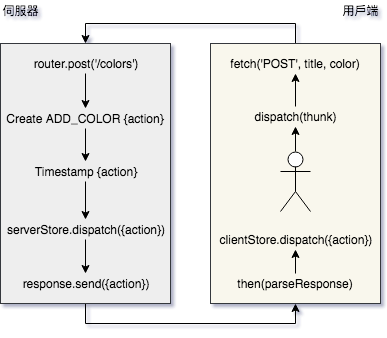

# Chap 12. React 與伺服器

目前我們使用 React
建構小應用程式完全在瀏覽器上執行．它們在瀏覽器上收集資料並以瀏覽器的儲存體儲存資料。這很合理，因為
React 是 view 層，它的目的是繪製 UI。然而，大部分的應用程式需要某種後端。我們必須認識如何建構有伺服器的應用程式。

就算你的用戶端應用程式完全依靠在雲端的後端，還是必須對這些服務收發資料。以 Flux
架構來說，有特定的地方可以進行這些交易，還有可處理 HTTP 請求延遲的函式庫。

此外 React
還可以**同構**的繪製，其表示它可以在瀏覽器以外的平台運作。這表示我們可以在傳送 UI
到瀏覽器前在伺服器上繪製。利用伺服器端的繪製，我們可以改善應用程式的效能、可攜性與安全性。

這一章從檢視同構與通用的差異以及兩者與 React
的關聯開始，接下來會看到如何使用通用的 JavaScript
建構同構應用程式。最後，我們會加上伺服器並在伺服器繪製 UI 以改善顏色管理的效能。

## 同構與通用

同構 (isomorphic) 與通用 (universal) 通常用於描述同時在用戶端與伺服器上運作的應用程式。雖然兩個詞都可以描述同一個應用程式，但還是有微妙的差別。

- **同構**應用程式是能在多種平台上繪製的應用程式
- **通用**程式碼表示完全相同的程式碼可在多種環境中執行

Node.js 能讓我們為瀏覽器寫的程式碼在其他伺服器、CLI
與原生平台上執行。讓我們看看一些通用的 JavaScript：

```javascript
var printNames = response => {
  var people = JSON.parse(response).results,
      names = people.map(({name}) => `${name.last}, ${name.first}`);
  console.log(names.join('\n'));
}
```

printNames 函式是通用的。同一個程式碼可在瀏覽器或伺服器上呼叫。通用 JavaScript
是在伺服器或用戶端執行都沒有問題的 JavaScript。

伺服器與用戶端是完全不同領域，因此 JavaScript 程式碼不會自動的通用。

```javascript
const request = new XMLHttpRequest();
request.open('GET', 'https://api.randomuser.me/?nat=US&results=10');
request.onload = () => printNames(request.response);
request.send();
```

若在瀏覽器執行正常，但在 Node.js 執行則會遇到錯誤：

```
ReferenceError: XMLHttpRequest is not defined
```

使用 Node.js 時，我們可以使用 http 模組發出請求：

```javascript
const https = require('https');
https.get(
  'https://api.randomuser.me/?nat=US&results=10',
  res => {
    
    let results = '';
    
    res.setEncoding('utf8');
    res.on('data', chunk => results += chunk);
    
    res.on('end', () => printNames(results));
  }
)
```

以 Node.js 從 API 載入資料需要用到核心模組，它需要不同程式碼。此例中，printNames
函式是通用的，因此同一個函式兩種環境都可運行。

你可以建構在瀏覽器或 Node.js 應用程式上輸出姓名到控制台的模組：

```javascript
var printNames = response => {
  var people = JSON.parse(response).results,
      names = people.map(({name}) => `${name.last}, ${name.first}`);
  console.log(names.join('\n'));
}
if (typeof window !== 'undefined') {
  const request = new XMLHttpRequest();
  request.open('GET', 'https://api.randomuser.me/?nat=US&results=10');
  request.onload = () => printNames(request.response);
  request.send();
} else {
  const https = require('https');
  https.get(
    'https://api.randomuser.me/?nat=US&results=10',
    res => {
      
      let results = '';
      
      res.setEncoding('utf8');
      res.on('data', chunk => results += chunk);
      
      res.on('end', () => printNames(results));
    }
  )
}
```

現在這個 JavaScript 檔案是同構的；它具有通用的 JavaScript。此程式碼並非通用，但檔案可在兩個環境上執行。

> Top! isomorphic-fetch  
> 我們使用 isomorphic-fetch 而非其他 WHATWG 函式是因為 isomorphic-fetch 可在多種環境運行。

讓我們看看 Star 元件。此元件是否通用？

```javascript
const Star = ({selected=false, onClick = f => f}) =>
  <div className={selected ? 'star select' : 'star'}
       onClick={onClick}>
  </div>
```

是通用的：此 JSX 會編議成 JavaScript。Star 元件只是函式。

我們可以在瀏覽器直接繪製這個元件，或在不同環境繪製並擷取 HTML 輸出字串，ReactDOM
有個 renderToString 方法可將 UI 繪製到 HTML 字串。

```javascript
ReactDOM.render(<Star />);

var html = ReactDOM.renderToString(<Star />);
```

我們可建構同構應用程式在不同平台上繪製元件，且能以跨多種環境重複使用 JavaScript
程式碼的方式設計這些應用程式。此外，我們可以使用 Go 或 Python
等其他語言建構同構應用程式，不只受限於 Node.js。

### 伺服器繪製 React

使用 ReactDOM.renderToString 方法可在伺服器上繪製
UI。伺服器能力很強；它們可以存取多種瀏覽器無法存取的資源。伺服器很安全，可存取受保護的資料。你可以在伺服器上繪製初始內容以利用這些優點。

讓我們使用 Node.js 與 Express 建構一個基本的網頁伺服器。Express 是開發網頁伺服器的函式庫：

```shell
$ npm i express --save
```

讓我們看一個簡單的 Express 應用程式。

- 每個請求日誌紀錄在控制台
- 伺服器回應某些 HTML
- 這些步驟是內建在它的函式並以 .use() 方法鏈結
- Express 自動以參數插入請求與回應參數到這些函式中

```javascript


const logger = (req, res, next) => {
  console.log(`${req.method} request for ${req.url}`);
  next();
};

const sayHello = (req, res) =>
  res.status(200).send('<h1>Hello World</h1>');

const app = express()
  .use(logger)
  .use(sayHello);

app.listen(3000, () =>
  console.log(`Recipe app running at 'http://localhost:3000'`)
);
```

logger 與 sayHello 函式是中介軟體 (.use()
方法鏈接)。請求發生時，每個中介軟體函式逐個被呼叫直到送出回應。

第十章使用 babel-cli 執行測試。我們在此處使用 babel-cli 執行此 Express
應用程式，因為它現在的 Node.js 版本不支援 ES6 import 陳述。

> Top! babel-cli 並非上線應用程式最好的解決方案，我們也不一定要用 babel-cli
> 執行每個使用 ES6 的 Node.js 應用程式。目前 Node.js 尚不支援 ES6 import 陳述。
>
> 另一個選項是建構為後端程式碼設計的 webpack。webpack 可匯出能在舊版 Node.js
> 執行的 JavaScript 包。

執行 babel-node 需要做一些設定。首先我們必須安裝：

```shell
$ npm i babel-cli babel-loader babel-preset-env babel-preset-react babel-preset-stage-0 --save
```

再來是加入 .babelrc 檔案：

```
{
  "presets": [
    "env",
    "stage-0",
    "react"
  ]
}
```

執行 `babel-node index-server.js`，Babel 會尋找這個檔案並套用我們有安裝的 preset。

最後，讓我們在 package.json 檔案加入 start 腳本：

```json
"scripts": {
  "start": "babel-node index-server.js"
},
```

現在我們可以使用 `npm start` 執行 Express 伺服器：

```shell
$ npm start

Recipe app running at 'http://localhost:3000'
```

目前此 Express
應用程式以相同的字串回應所有的請求。讓我們繪製第四章與第五章的食譜應用程式，我們可使用
ReactDOM 的 renderToString 繪製 Menu 元件與一些食譜資料：

```javascript
import React from 'react';
import {renderToString} from 'react-dom/server';
import express from 'express';
import Menu from "./components/Menu";
import data from './assets/recipes';

global.React = React;

const html = renderToString(<Menu recipes={data}/>);

const logger = (req, res, next) => {
  console.log(`${req.method} request for ${req.url}`);
  next();
};

const sendHTMLPage = (req, res) =>
  res.status(200).send(`
    <!doctype html>
    <html lang="en">
    <head>
      <meta charset="UTF-8">
      <meta name="viewport"
            content="width=device-width, user-scalable=no, initial-scale=1.0, maximum-scale=1.0, minimum-scale=1.0">
      <meta http-equiv="X-UA-Compatible" content="ie=edge">
      <title>React Recipes App</title>
    </head>
    <body>
    <div id="react-container">${html}</div>
    </body>
    </html>
  `);


const app = express()
  .use(logger)
  .use(sendHTMLPage);

app.listen(3000, () =>
  console.log(`Recipe app running at 'http://localhost:3000'`)
);
```

React 全域的顯露，因此 renderToString 可正確的運作。

我們有了伺服器繪製的 Menu 元件。我們的應用程式還不是同構，因為元件只在伺服器繪製。要讓它同構，我們需要在回應加上一些 JavaScript，以讓同一個元件可在瀏覽器中繪製。

讓我們建構在瀏覽器中執行的 index-client.js 檔案：

```javascript
import React from 'react';
import {render} from 'react-dom';
import Menu from "./components/Menu";

window.React = React;

alert('bundle loaded, Rendering in browser');

render(
  <Menu recipes={__DATA__}/>,
  document.getElementById('react-container')
);

alert('render complete');
```

瀏覽器載入此腳本時，`__DATA__` 已經存在與全域範圍中。alert 方法用於提示瀏覽器繪製了 UI。

我們需要將 client.js 檔案加入瀏覽器使用的程式包。一個基本的 webpack 組態可處理：

```javascript
const webpack = require('webpack');

module.exports = {
  entry: "./index-client.js",
  output: {
    path: path.resolve(__dirname, 'assets'),
    filename: "bundle.js",
  },
  module: {
    rules: [
      {
        test: /\.js$/,
        exclude: /(node_modules)/,
        use: {
          loader: 'babel-loader',
          options: {
            presets: ['env', 'stage-0', 'react']
          }
        },
      }
    ]
  }
}
```

我們想要在每次啟動應用程式時建構用戶端程式包，因此必須將啟動腳本加入到 package.json 檔案中：

```json
"scripts": {
  "prestart": "webpack --progress",
  "start": "babel-node index-server.js"
},
```

最後是修改伺服器：

```javascript
const sendHTMLPage = (req, res) =>
  res.status(200).send(`
    <!doctype html>
    <html lang="en">
    <head>
      <meta charset="UTF-8">
      <meta name="viewport"
            content="width=device-width, user-scalable=no, initial-scale=1.0, maximum-scale=1.0, minimum-scale=1.0">
      <meta http-equiv="X-UA-Compatible" content="ie=edge">
      <title>React Recipes App</title>
    </head>
    <body>
    <div id="react-container">${html}</div>
    <script>
        window.__DATA__ = ${JSON.stringify(data)}
    </script>
    <script src="bundle.js"></script>
    </body>
    </html>
  `);


const app = express()
  .use(logger)
  .use(express.static('./assets'))
  .use(sendHTMLPage);
```

現在我們同構了 React 元件，先是伺服器，然後是瀏覽器。執行此應用程式時，你會在瀏覽器繪製該元件前後看到警示對話框。你會注意到關閉第一個警示對話框前內容已經顯示，這是因為它是在伺服器上繪製。

繪製同一個內容兩次似乎不太對，但這樣有好處。此應用程式在各種瀏覽器上繪製相同內容，就算關掉 JavaScript 也一樣。由於內容是初始請求載入，網站會跑得比較快且更快的傳送資料給行動使用者。它無需等待行動處理器繪製 UI —— UI 已經就位。此外，此應用程式利用了 SPA 的各種好處。同構的 React 應用程式兩面玲瓏。

## 通用顏色管理

前面五章建構顏色管理應用程式。我們已經有許多程式碼可供建構網頁伺服器時重複使用。

讓我們為此應用程式建構一個 Express 伺服器並盡可能重複使用程式碼。首先，需要設定 Express 應用程式實例的模組，所以讓我們建構 ./server/app.js：

```javascript
import express from 'express';
import path from 'path';

const fileAssets = express.static(
  path.join(__dirname, '../../dist/assets')
);

const logger = (req, res, next) => {
  console.log(`${req.method} request for ${req.url}`);
  next();
};

const respond = (req, res) =>
  res.status(200).send(`
    <!doctype html>
    <html lang="en">
    <head>
      <meta charset="UTF-8">
      <meta name="viewport"
            content="width=device-width, user-scalable=no, initial-scale=1.0, maximum-scale=1.0, minimum-scale=1.0">
      <meta http-equiv="X-UA-Compatible" content="ie=edge">
      <title>Universal Color Organizer</title>
    </head>
    <body>
    <div id="react-container">ready...</div>
    </body>
    </html>
  `);


export default express()
  .use(logger)
  .use(fileAssets)
  .use(respond);
```

此模組是我們通用應用程式的啟動點。

webpack 能讓我們匯入 CSS 或圖案等內容，但 Node.js 不遂知道如何處理這些匯入內容。我們必須使用 ignore-styles 函式庫以確保略過 SCSS 匯入陳述：

```shell
$ npm i ignore-styles --save
```

此檔案代表 Node.js 伺服器的進入點：

```javascript
import React from 'react';
import ignoreStyles from 'ignore-styles';
import app from './app';

global.React = React;

app.set('port', process.env.PORT || 3000)
  .listen(
    app.get('port'),
    () => console.log(`Color Organizer running at 'http://localhost:${app.get('port')}'`)
  );
```

此檔案將 React 加到全域實例並啟動伺服器。此外，我們引入 ignore-styles 模組，它會略過這些匯入以讓我們在 Node.js 繪製元件且不會引發錯誤。

現在我們有個啟動點：一個基本的 Express 應用程式組態。需要在伺服器引入新功能時，它們必須加到此應用程式組態模組。

這章其餘內容會一直反覆修改 Express 應用程式。我們會建構同構/通用版本的顏色管理應用程式。

### 通用 Redux

Redux 函式庫中的所有 JavaScript 都是通用的。你的 reducer 是以 JavaScript 撰寫且程式碼應該沒有與環境相依。Redux 被設計作為瀏覽器應用程式狀態容器，但可用於各種 Node.js 應用程式，包括 CLI、伺服器與原生應用程式。

我們用 Redux 的 store 將狀態的改變儲存在伺服器上的 JSON 檔案中。

首先，我們必須修改 storeFactory 以讓他可以同構的運作。

- console.groupCollapsed
- console.groupEnd

這兩項 Node.jks 沒有這方法，server 建構 store，需要使用不同的日誌紀錄：


```javascript
import {createStore, combineReducers, applyMiddleware} from "redux";
import {colors} from './reducer';

const clientLogger = store => next => action => {
  let result;
  console.groupCollapsed("dispatching", action.type);
  console.log('prev state', store.getState());
  console.log('action', action);
  result = next(action);
  console.log('next state', store.getState());
  console.groupEnd();
  return result;
};

const serverLogger = store => next => action => {
  console.log('\n dispatching server action\n');
  console.log(action);
  console.log('\n');
  return next(action);
};

const middleware = server =>
  (server) ? serverLogger : clientLogger;

const storeFactory = (server = false, initialState = {}) =>
  applyMiddleware(middleware)(createStore)(
    combineReducers({colors}),
    initialState
  );

export default storeFactory;
```

現在 storeFactory 是同構的。我們建構了在伺服器記錄動作的 Redux 中介軟體。storeFactory 被叫用時，我們會告訴它我們想要在新的 store 實例中接入哪一種日誌記錄程序。

我們要建構 serverStore 的實例。在 Express 組態裡面，我們必須要匯入 storeFactory 與初始狀態資料：

```javascript
import storeFactory from "../store";
import initialState from '../../data/initialState';

const serverStore = storeFactory(true, initialState);
```

現在我們有個在伺服器上執行的 store 實例。

每當有 action 分發給此實例，我們會想要確保 initialState.json 檔案被更新。使用 subscript 方法傾聽狀態的改變，並於改變時儲存新的 JSON 檔案。

```javascript
serverStore.subscribe(() =>
  fs.writeFile(
    path.join(__dirname, '../../data/initialState.json'),
    JSON.stringify(serverStore.getState()),
    error => (error) ?
      console.log('Error saving state!', error) :
      null
  )
);
```

新的 action 被分發，新的狀態以 fs 模組儲存到 initialState.json 檔案。

現在 serverStore 是主要的事實來源，請求必須與它溝通以取得最新的顏色清單。我們會加入一些中介軟體以將伺服器 store 加入請求管道，讓其他中介軟體在請求時可以使用它：

```javascript
const aaddStoreToRequestPipeline = (req, res, next) => {
  req.store = serverStore;
  next();
};

export default express()
  .use(logger)
  .use(fileAssets)
  .use(aaddStoreToRequestPipeline)
  .use(htmlResponse);
```

現在任何 addStoreToRequestPipeline 之後的中介軟體方法可存取 request 物件中的 store。我們通用的使用 Redux。包括我們的 reducer 在內的 store 程式碼可在多種環境下執行。

### 通用路由

上一章對顏色管理加上 react-router-dom。router 根據瀏覽器目前位置判斷要繪製哪一個元件。router 也可在伺服器上繪製 —— 我們只需要提供位置或路由。

目前我們使用 HashRouter。此 router 自動在每個路由前面加上 #。要同構使用 router，必須以 BrowserRouter 取代 HashRouter，它會從路由刪除前綴的 #。

```javascript
import {BrowserRouter} from 'react-router-dom';

...

render(
  <Provider store={store}>
    <BrowserRouter>
      <App />
    </BrowserRouter>
  </Provider>,
  document.getElementById('react-container')
);
```

現在顏色管理的路由不再有井號。此時管理應用程式還是可以運作，啟動它並選取一個顏色。Color 容器被繪製，它使用 ColorDetails 元件改變整個畫面的背景。

現在位置列：

```
http://localhost:3000/8658c1d0-9eda-4a90-95e1-8001e8eb6036
```

路由前面不再有 #。現在重新載入網頁：

```
Cannot GET /8658c1d0-9eda-4a90-95e1-8001e8eb6036
```

重新載入網頁使得瀏覽器以目前的路由發出 GET 請求給伺服器。# 用於防止發出 GET 請求。我們使用 BrowserRouter 是因為想要發送 GET 請求給伺服器。為在伺服器上繪製 router，我們需要位置 —— 我們需要路由。此路由會用在伺服器上以告訴 router 去繪製 Color 容器。想要同構的繪製路由時使用 BrowserRouter。

現在我們知道使用者請求什麼內容，讓我們在伺服器上繪製 UI。為在伺服器上繪製 router，我們必須對 Express 組態做一些重大的改變。我們必須匯入幾個模組：

```javascript
import {Provider} from 'react-redux';
import {compose} from 'redux';
import {renderToString} from 'react-dom/server';
import {StaticRouter} from 'react-router-dom';
```

在伺服器上，想要將元件樹繪製到字串時使用 StaticRouter。

為產生 HTML，有三個步驟：

1. 使用 serverStore 的資料建構在用戶端執行的 store
2. 使用 StaticRouter 將元件樹繪製成 HTML
3. 建構傳送給用戶端的 HTML 網頁

我們為每個步驟建構一個函式並組成 htmlResponse 單一函式：

```javascript
const htmlResponse = compose(
  buildHTMLPage,
  renderComponentsToHTML,
  makeClientStoreFrom(serverStore)
);
```

makeClientStoreFrom (serverStore) 是個高階函式。開始時，此函式以 serverStore 呼叫一次。它回傳每個請求會呼叫的函式，被回傳的函式可存取 serverStore。

呼叫 htmlResponse 時，它預期一個參數：使用者請求 url。對步驟一，我們會建構包裝 url 與使用目前 serverStore 的狀態建構新用戶端 store 之高階函式。store 與 url 會以一個物件傳遞給下一個函式，步驟 2：

```javascript
const makeClientStoreFrom = store => url =>
  ({
    store: storeFactory(false, store.getState()),
    url
  });
```

makeClientStoreFrom 函式的輸出成為 renderComponentToHTML 函式的輸入。此函式預期 url 與 store 包裝在單一參數中：


```javascript
const renderComponentsToHTML = ({url, store}) =>
  ({
    state: store.getState(),
    html: renderToString(
      <Provider store={store}>
        <StaticRouter location={url} context={{}}>
          <App/>
        </StaticRouter>
      </Provider>
    )
  });
```

StaticRouter 元件根據請求的位置繪製 UI。StaticRouter 需要 location 與 context。請求的 url 傳給 location 屬性且空物件傳給 context。將執行元件繪製成 HTML 字串時，位置會被代入且 staticRouter 會繪製正確的路由。

此函式回傳建構網頁的兩個必要元件：

- 管理程式目前的狀態
- 繪製成 HTML 字串的 UI

state 與 html 可用於 buildHTMLPage 這個組合函式：

```javascript
const buildHTMLPage = ({html, state}) => `
  <!doctype html>
  <html lang="en">
  <head>
    <meta charset="UTF-8">
    <meta name="viewport"
          content="width=device-width, user-scalable=no, initial-scale=1.0, maximum-scale=1.0, minimum-scale=1.0">
    <meta http-equiv="X-UA-Compatible" content="ie=edge">
    <title>Universal Color Organizer</title>
  </head>
  <body>
  <div id="react-container">${html}</div>
  <script>
      window.__INITIAL_STATE__ = ${JSON.stringify(state)}
  </script>
  <script src="/bundle.js"></script>
  </body>
  </html>
`;
```

現在顏色管理是同構的。它會在伺服器繪製 UI 然後以文字傳送給用戶端，還會直接在回應中夾帶初始狀態。

瀏覽器先以 HTML 回應中的 UI 顯示。載入程式包後，它會重新繪製 UI 並從此接手。此後，包括瀏覽在內的所有使用者互動會發生在用戶端。我們的單頁應用程式還是繼續運作，除非瀏覽器重新載入網頁，此時伺服器的繪製程序會再來一次。

```javascript
// src/server/app.js
import express from 'express';
import path from 'path';
import fs from 'fs';
import {Provider} from 'react-redux';
import {compose} from 'redux';
import {renderToString} from 'react-dom/server';
import storeFactory from "../store";
import initialState from '../../data/initialState';
import App from "../components/App";

const fileAssets = express.static(path.join(__dirname, '../../dist/assets'));

const serverStore = storeFactory(true, initialState);

serverStore.subscribe(() =>
  fs.writeFile(
    path.join(__dirname, '../../data/initialState.json'),
    JSON.stringify(serverStore.getState()),
    error => (error) ?
      console.log('Error saving state!', error) :
      null
  )
);

const logger = (req, res, next) => {
  console.log(`${req.method} request for ${req.url}`);
  next();
};

const buildHTMLPage = ({html, state}) => `
  <!doctype html>
  <html lang="en">
  <head>
    <meta charset="UTF-8">
    <meta name="viewport"
          content="width=device-width, user-scalable=no, initial-scale=1.0, maximum-scale=1.0, minimum-scale=1.0">
    <meta http-equiv="X-UA-Compatible" content="ie=edge">
    <title>Universal Color Organizer</title>
  </head>
  <body>
  <div id="react-container">${html}</div>
  <script>
      window.__INITIAL_STATE__ = ${JSON.stringify(state)}
  </script>
  <script src="/bundle.js"></script>
  </body>
  </html>
`;

const renderComponentsToHTML = ({url, store}) =>
  ({
    state: store.getState(),
    html: renderToString(
      <Provider store={store}>
        <StaticRouter location={url} context={{}}>
          <App/>
        </StaticRouter>
      </Provider>
    )
  });

const makeClientStoreFrom = store => url =>
  ({
    store: storeFactory(false, store.getState()),
    url
  });

const htmlResponse = compose(
  buildHTMLPage,
  renderComponentsToHTML,
  makeClientStoreFrom(serverStore)
);

const respond = ({url}, res) =>
  res.status(200).send(
    htmlResponse(url)
  );

const addStoreToRequestPipeline = (req, res, next) => {
  req.store = serverStore;
  next();
};

export default express()
  .use(logger)
  .use(fileAssets)
  .use(addStoreToRequestPipeline)
  .use(respond);
```

我們的應用程式現在能讓使用者儲存書籤，並傳送同構繪製的 URL 給其他使用者。router 根據 URL 判斷繪製什麼內容。它在伺服器上這麼做，這表示使用者可快速的存取內容。

同構應用程式兩面玲瓏：它們有伺服器繪製的快速、控制與安全，且同時享受單頁應用程式的低頻寬與速度。同構 React 應用程式基本上是伺服器端繪製的 SPA，提供建構又酷又快速有效率的應用程式的基礎。

```javascript
// src/index.js
import React from 'react';
import {render} from 'react-dom';
import App from "./components/App";
import storeFactory from './store';
import {Provider} from "react-redux";
import {BrowserRouter} from 'react-router-dom';

const store = storeFactory(false, window.__INITIAL_STATE__);

window.React = React;
window.store = store;

render(
  <Provider store={store}>
    <BrowserRouter>
      <App />
    </BrowserRouter>
  </Provider>,
  document.getElementById('react-container')
);
```

### 運用伺服器繪製樣式

目前我們在伺服器上繪製 HTML，但 CSS 在瀏覽器載入程式包前不會繪製，使得畫面會奇怪的閃動更新。一開始，我們會在瀏覽器看到載入 CSS 前還沒有套用樣式的內容。瀏覽器關閉 JavaScript 時，使用者完全不會看到 CSS 樣式，因為它們是埋在 JavaScript 程式包中。

解決方案是直接在回應中加入樣式。我們先從 webpack 擷取 CSS 到另一個檔案。你必須安裝 extract-text-webpack-plugin：

```shell
$ npm i extract-text-webpack-plugin
```

webpack 組態還需要這個外掛：

```javascript
const ExtractTextPlugin = require("extract-text-webpack-plugin");
```

還有，在 webpack 組態中，我們必須以使用 ExtractTextPlugin 的載入程序取代 CSS 與 SCSS 載入程序：

```javascript
{
  test: /\.css$/,
  loader: ExtractTextPlugin.extract({
    fallback: 'style-loader',
    use: ['style-loader', 'css-loader', {
      loader: 'postcss-loader',
      options: {
        plugins: () => [require('autoprefixer')]
      }
    }]
  })
},
{
  test: /\.scss/,
  loader: ExtractTextPlugin.extract({
    fallback: 'style-loader',
    use: ['css-loader', {
      loader: 'postcss-loader',
      options: {
        plugins: () => [require('autoprefixer')]
      }
    }, 'sass-loader']
  })
}
```

我們還必須在外掛陣列引入該外掛。引入該外掛時，我們指定要擷取的 CSS 檔案名稱：

```javascript
plugins: [
  new ExtractTextPlugin("bundle.css"),
  new webpack.DefinePlugin({
    "process.env": {
      NODE_ENV: JSON.stringify("production")
    }
  }),
...
```

接下來 webpack 執行，它不會在 JavaScript 程式包中加入該 CSS；所有 CSS 會放在 ./assets/bundle.css 中。

我們必須修改 Express 組態。程式啟動時，CSS 被儲存成全域字串。我們可使用檔案系統或 fs 模組讀取文字檔案的內容到 staticCSS 變數中：

```javascript
const staticCSS = fs.readFileSync(path.join(__dirname, '../../dist/assets/bundle.css'));
```

以 CSS 直接寫入回應的 `<style>` 標籤中：

```javascript
const buildHTMLPage = ({html, state}) => `
  <!doctype html>
  <html lang="en">
  <head>
    <meta charset="UTF-8">
    <meta name="viewport"
          content="width=device-width, user-scalable=no, initial-scale=1.0, maximum-scale=1.0, minimum-scale=1.0">
    <meta http-equiv="X-UA-Compatible" content="ie=edge">
    <title>Universal Color Organizer</title>
    <style>${staticCSS}</style>
  </head>
  <body>
  <div id="react-container">${html}</div>
  <script>
      window.__INITIAL_STATE__ = ${JSON.stringify(state)}
  </script>
  <script src="/bundle.js"></script>
  </body>
  </html>
`;
```

現在 CSS 直接埋在回應中，不再有奇怪的樣式閃動。關掉 JavaScript 時樣式還在。

現在我們有個同構的顏色管理程式共用通用的 JavaScript。一開始，顏色管理程式在伺服器繪製，但載入後也在瀏覽器上繪製。瀏覽器接手後，顏色管理程式的行為如同單頁應用程式。

## 與伺服器溝通

使用者在本機分發 action、本機的狀態改變、本機的 UI 更新。所有東西在瀏覽器上運行，但被分發的 action 沒有回到伺服器。

接下來我們不只確保資料儲存在伺服器上，我們還會確保 action 物件在伺服器上建構並分發到兩邊的 store。

### 在伺服器處理 action

在顏色管理程式中，我們會整合處理資料的 REST API。action 會在用戶端初始化、在伺服器完成，然後分發給兩邊的 store。serverStore 會儲存新狀態到 JSON，而用戶端 store 會觸發 UI 更新。兩個 store 會分發相同的 action。



讓我們看個分發 ADD_COLOR 的完整例子：

1. 以新名稱與顏色分發 action 建構程序 addColor()
2. 在新的 POST 請求中傳送資料給伺服器
3. 在伺服器建構與分發新的 ADD_COLOR
4. 在回應內容中傳送 ADD_COLOR
5. 在用戶端解析回應內容並分發 ADD_COLOR

要做的第一件事情就是建構 REST API。建構 `./src/server/color-api.js` 的檔案。

每個 action 都以相同方式處理：在伺服器分發然後傳送給用戶端。讓我們建構分發 action 給 serverStore 並以回應物件傳送 action 給用戶端的函式：

```javascript
const dispatchAndRespond = (req, res, action) => {
  req.store.dispatch(action);
  res.status(200).json(action);
}
```

有 action 時，我們可以使用此函式分發 action 並傳送回應給用戶端。

我們必須使用處理各種 HTTP 請求的 Express 的 Router 建構一些 HTTP 端點。我們會建構在 /api/colors 處理 GET、POST、PUT 與 DELETE 請求的路由。Express 的 Router 可建構這些路由。每個路由帶有建構不同 action 物件並加上請求與回應物件傳送給 dispatchAndRespond 函式的邏輯：

```javascript
import {Router} from 'express';
import {v4} from 'uuid';

const dispatchAndRespond = (req, res, action) => {
  req.store.dispatch(action);
  res.status(200).json(action);
};

const router = Router();

router.get('/colors', (req, res) =>
  res.status(200).json(req.store.getState().colors)
);

router.post('/colors', (req, res) =>
  dispatchAndRespond(req, res, {
    type: 'ADD_COLOR',
    id: v4(),
    title: req.body.title,
    color: req.body.color,
    timestamp: new Date().toString()
  })
);

router.put('/color/:id', (req, res) =>
  dispatchAndRespond(req, res, {
    type: 'RATE_COLOR',
    id: req.params.id,
    rating: parseInt(req.body.rating)
  })
);

router.delete('/color/:id', (req, res) =>
  dispatchAndRespond(req, res, {
    type: 'REMOVE_COLOR',
    id: req.params.id
  })
);

export default router;
```

現在我們定義了路由，我們必須將它們加入 Express 應用程式的組態。首先，安裝 Express 的 body-parser：

```shell
$ npm i boedy-parser --save
```

body-parser 解析請求內容並取得傳給路由的變數，並須從用戶端取得新顏色與評分的資訊。我們必須在 Express 應用程式組態加入這個中介軟體。讓我們匯入 body-parser 與新路由到 ./server/app.js 檔案中：

```javascript
import bodyParser from 'body-parser';
import api from './color-api';

export default express()
  .use(logger)
  .use(fileAssets)
  .use(bodyParser.json())
  .use(addStoreToRequestPipeline)
  .use('/api', api)
  .use(respond);
```

在 API 之前加入 bodyParser 以讓資料在 API 處理請求時被解析很重要。

bodyParser.json() 解析 JSON 格式請求內容。

現在，我們的 Express 應用程式有端點回應 HTTP 請求，可以修改前端 action 建構程序以與這些端點溝通。

### action 與 Redux Thunk

主從通訊的一個問題是延遲，也就是傳送請求後等待回應的時間。我們的 action 建構程序在分發 action 前必須等待回應，因為我們的解決方案中的 action 本身要從伺服器送到用戶端。Redux 處理非同步 action 的中介軟體是：redux-thunk。

接下來我們會使用 redux-thunk 重新撰寫 action 建構程序。這些稱為 thunk 的 action 建構程序能讓我們在本機分發 action 前等待伺服器的回應。thunk 是高階函式。相較於 action 物件，它們回傳其他函式。讓我們安裝 redux-thunk：


```shell
$ npm i redux-thunk --save
```

redux-thunk 是中介軟體；它需要與 storeFactory 合作：

```javascript
// src/store/index.js
import thunk from 'redux-thunk';

const middleware = server => [
  (server) ? serverLogger : clientLogger,
  thunk
];

const storeFactory = (server = false, initialState = {}) =>
  applyMiddleware(...middleware(server))(createStore)(
    combineReducers({colors}),
    initialState
  );
```

讓我們檢視目前的新增顏色的 action 建構程序：

```javascript
export const addColor = (title, color) =>
  ({
    type: C.ADD_COLOR,
    id: v4(),
    title,
    color,
    timestamp: new Date().toString()
  });

...

store.dispatch(addColor('jet', '#000000'));
```

此 action 建構程序回傳 addColor 這個 action 物件，該物件立刻被分發到 store。現在讓我們檢視 thunk 版本的 addColor：

```javascript
export const addColor = (title, color) =>
  (dispatch, getState) => {

    setTimeout(() =>
      dispatch({
        type: C.ADD_COLOR,
        index: getState().colors.length + 1,
        title,
        color,
        timestamp: new Date().toString()
      })
    , 2000);
  
  };

...

store.dispatch(addColor('jet', '#000000'));
```

thunk 回傳的是函式而非 action。回傳的函式是以參數接收 store 的 dispatch 與 getState 方法的 callback。可在就緒時分發 action。此例中，分發新顏色會有前兩秒延遲。

除了 dispatch，thunk 還可存取 store 的 getState 方法。此例中，我們用它目前狀態中的顏色數量建構索引欄。此函式在根據 store 的資料建構 action 時很有用。

> Top! 並非每個 action 建構程序都要做成 trunk。redux-thunk 中介軟體知道 thunk 與 action 物件的差別。action 物件會立即分發。

thunk 有其他好處。它們可以非同步的呼叫 dispatch 或 getState，且不限於分發一種 action。下一個範例中， thunk 立即分發 RANDOM_RATING_STARTED，並重複分發隨機評分顏色的 RATE_COLOR：

```javascript
export const rateColor = id =>
  (dispatch, getState) => {
    dispatch({type: 'RANDOM_RATING_STARTED'});
    setInterval(() =>
      dispatch({
        type: 'RATE_COLOR',
        id,
        rating: Match.floor(Match.randow()*5)
      })
    , 1000);
  };

...

store.dispatch(
  rateColor('f9005b4e-975e-433d-a646-79df172e1dbb')
);
```

這些是 thunk 範例。讓我們建構顏色管理的 thunk 以取代目前的 action 建構程序。

首先，建構 fetchThenDispatch 函式。此函式使用 isomorphic-fetch 傳送請求到網路服務並自動的分發回應：

```javascript
import fetch from 'isomorphic-fetch';

const parseResponse = response => response.json();

const logError = error => console.error(error);

const fetchThenDispatch = (dispatch, url, method, body) =>
  fetch(
    url,
    {
      method,
      body,
      headers: {'Content-Type': 'application/json'}
    }
  ).then(parseResponse)
    .then(dispatch)
    .catch(logError);
````

使用 fetchThenDispatch 函式建構 thunk：

```javascript
export const addColor = (title, color) =>
  (dispatch) =>
    fetchThenDispatch(
      dispatch,
      '/api/colors',
      'POST',
      JSON.stringify({title, color})
    );

export const removeColor = id =>
  dispatch =>
    fetchThenDispatch(
      dispatch,
      `/api/color/${id}`,
      'DELETE'
    );

export const rateColor = (id, rating) =>
  dispatch =>
    fetchThenDispatch(
      dispatch,
      `/api/color/${id}`,
      'PUT',
      JSON.stringify({rating})
    );
```

接下來執行應用程式時，你可以從控制台紀錄看到 action 被分發到兩邊的 store。瀏覽器控制台與伺服器控制台。

#### 使用 thunk 與 websocket

顏色管理程式透過 REST 與伺服器通訊。thunk 也可透過 websocket 傳送與接收。websocket 是用戶端與伺服器間的雙向連線。websocket 可傳送資料到伺服器，但伺服器也可傳送資料到用戶端。

使用 websocket 與 thunk 的一種方式是分發 connect 這個 action 建構程序。舉例來說，假設我們想要連接訊息伺服器：

```javascript
store.dispatch(connectToMessageSocket());
```

thunk 可任意呼叫分發。我們建構傾聽訊息的 thunk 並於接收時分發 NEW_MESSAGE。下一個範例使用 socket.io-client 連接 socket.io 伺服器並傾聽訊息：

```javascript
import io from 'socket.io-client';

const connectToChatSocket = () => dispatch => {
  
  dispatch({type: 'CONNECTING'});
  
  let socket = io('/message-socket');
  
  socket.on('connect', () =>
    dispatch({type: 'CONNECTED', id: socket.id})
  );
  
  socket.on('message', (message, user) =>
    dispatch({type: 'NEW_MESSAGE', message, user})
  );
  
}

export default connectToChatSocket;
```

connectToChatSocket 被呼叫時，一個 CONNECTING 被分發。然後我們嘗試連接訊息的 socket。連接後，socket 會以連接事件回應。於發生時，我們可以分發 CONNECTED 與關於目前 socket 的資訊。

伺服器送出新訊息時，訊息事件在 socket 上發出。每當 NEW_MESSAGE 從伺服器收到用戶端時我們可以在本機分發此 action。

你建構的每個 React 應用程式幾乎都需要某種網頁伺服器。有時候你只需要網頁伺服器來安置應用程式，其他狀況則需要與網路服務通訊。有些高流量的應用程式需要在多個平台上完全不同的解決方案。

#### 進階資料擷取

若你正在設計在多個平台上共用資料的高流量應用程式，你也許應該看看 Relay 與 GraphQL 或 Falcor 等框架。這些框架提供更好的應用程式必要資料取得解決方案。

GraphQL 是 Facebook 開發的宣告式資料查詢解決方案，可從多個來源查詢資料。GraphQL 可用於各種語言與平台。

Relay 是個函式庫，也是 Facebook 開發的，它透過連接 GraphQL 查詢與 React 或 React Native 元件處理用戶端應用程式的資料擷取。

GraphQL 與 Relay 的學習曲線有點難度，但若喜歡宣告式程式設計則值得一試。

Falcor 是 Netflix 開發的框架，處理擷取與有效使用資料的問題。如同 GraphQL，Falcor 可讓你從一個地方查詢多個服務的資料。Falcor 使用 JavaScript 查詢資料，其學習曲線可能對 JavaScript 開發者比較容易一點。

React 開發的關鍵是知道使用正確的工具。你已經學到許多建構良好應用程式的工具。只使用有需要的。若你的應用程式不依靠大量資料，別使用 Redux。React 的狀態是適合大小應用程式的最佳解決方案。你的應用程式也許不需要伺服器繪製，除非是有大量互動的應用程式需要大量行動流量，否則先別考慮使用它。

使用 React、Redux 與函式性、宣告式 JavaScript 建構應用程式很有意思，我們等不及看到你的作品。